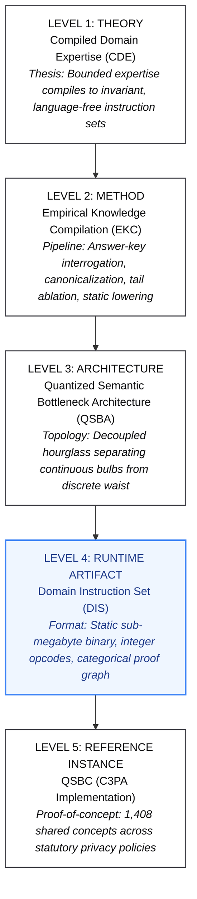
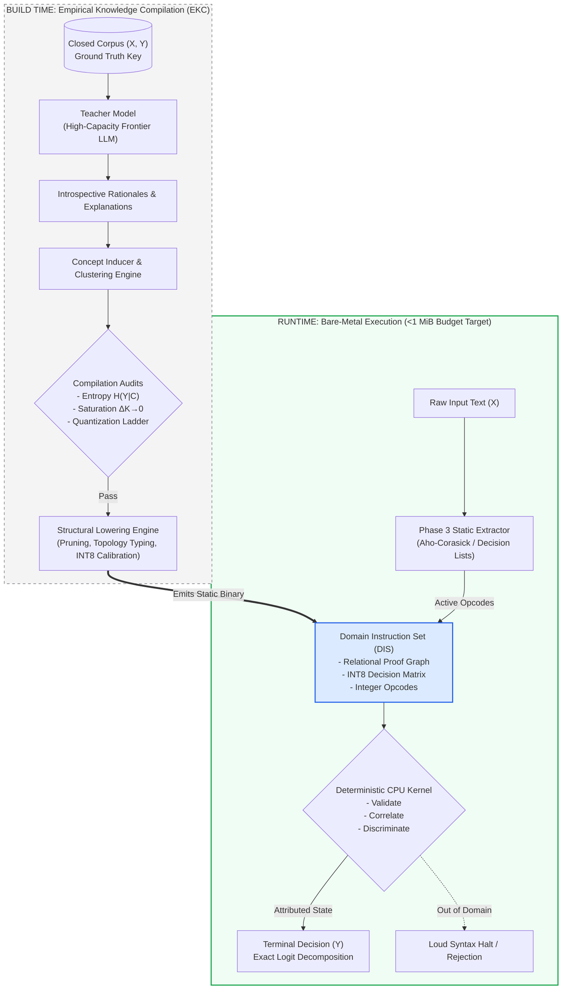
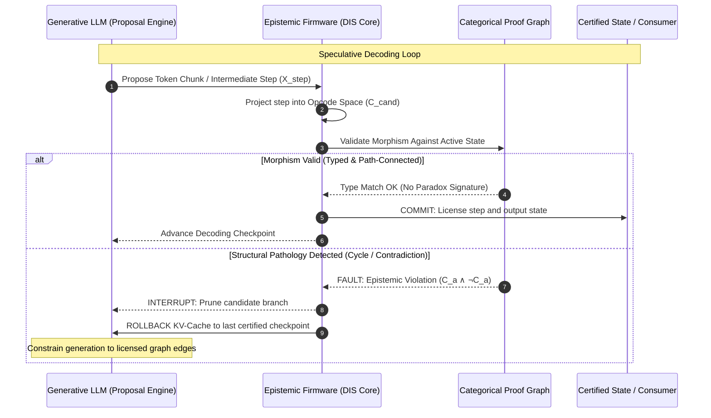
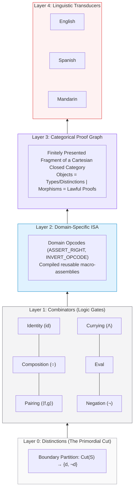
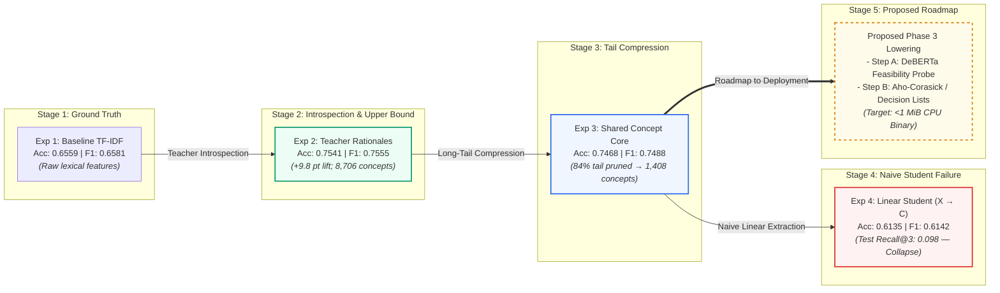

# Preface

This specification is the direct result of an engineering dead-end.

In earlier published work and multi-agent experiments, I explored how far role decomposition, state machines, and recursive supervision could push the reliability of frontier language models. By structuring agents into specialized personas—architects, implementers, and reviewers constrained by strict operational boundaries—it was possible to orchestrate functional software workflows with minimal direct human coding.

Yet every iteration ran into the same fundamental wall: **who verifies the verifier?**

Layering agents on top of agents to catch hallucinations, audit code, and enforce rules simply moves uncertainty around in a circle. Two models agreeing is evidence; it is not proof. When the verification gate is itself a stochastic token predictor, the system never truly leaves the probabilistic stack, remaining vulnerable to silent, compounding failure modes.

To achieve deterministic operational integrity in high-stakes environments, verification cannot rely on continuous neural inference at runtime. The rules governing validity must exist outside the model entirely—as an explicit, deterministic, and inspectable substrate.

The **Compiled Domain Expertise (CDE)** framework and the **Quantized Semantic Bottleneck Architecture (QSBA)** are designed around a different answer: severing knowledge acquisition from knowledge execution.

* **At build time**, high-capacity models operate offline as an empirical knowledge compiler to explore a closed domain, extract candidate reasoning structures, and surface inferential dependencies.
* **At runtime**, the architecture seeks to execute only the surviving, empirically validated structures after they have been lowered into a **Domain Instruction Set (DIS)**—with an explicit design target of a sub-megabyte, integer-only artifact executing deterministically on standard CPU hardware without an active language model.

This document does not propose an open-world artificial general intelligence. It specifies an architecture for bounded, auditable, and durable domain competence.

— *Jarad R. Peckenpaugh*  
*September 2026*

---

# Compiled Domain Expertise (CDE): An Architectural Specification of the Quantized Semantic Bottleneck Architecture (QSBA) and Domain Instruction Sets (DIS)

The dominant paradigm in contemporary artificial intelligence conflates two fundamentally distinct computational processes: knowledge acquisition and knowledge execution. Frontier deep neural networks operate as probabilistic proposal engines, generating language via dense floating-point continuous manifolds. While effective for open-domain pattern synthesis, this continuous substrate introduces fundamental vulnerabilities in high-stakes environments: parameter bloat, uninspectable latent mechanisms, high computational overhead, and silent failures where factually correct conclusions are generated through invalid reasoning paths.

The **Compiled Domain Expertise (CDE)** framework treats domain competence not as a continuous probability distribution $P(Y \mid X)$, but as a compilation target. By decoupling expensive, build-time semantic extraction from runtime execution, CDE formalizes the distillation of an expert's reasoning into an explicit, static, CPU-executable instruction set.

### The Five-Tier Taxonomy

The structural hierarchy of this specification spans five distinct conceptual layers:

* **Level 1: Theory — Compiled Domain Expertise (CDE):** The governing thesis that bounded human expertise in a versioned domain can be functionally compiled into an invariant, language-free instruction set with formal runtime integrity guarantees.
* **Level 2: Method — Empirical Knowledge Compilation (EKC):** The empirical pipeline of interrogating teacher models with ground-truth answer keys, canonicalizing discovered propositions, ablating redundant structures, and lowering decision rules into static artifacts.
* **Level 3: Architecture — Quantized Semantic Bottleneck Architecture (QSBA):** The structural hourglass topology separating high-dimensional, continuous linguistic interfaces from a discrete, quantized, language-agnostic core.
* **Level 4: Artifact — Domain Instruction Set (DIS):** The deployable binary specification—a finite alphabet of integer opcodes, relational dependency graphs, and quantized transition weights executing on bare silicon.
* **Level 5: Reference Instance — QSBC:** The historical reference implementation demonstrating the architecture on the California Consumer Privacy Act (C3PA) corpus.



---

## 1. The Epistemological Contract (Preamble Disclaimers)

The validity of the QSBA specification relies on an explicit break from the assumptions of classical machine learning. The architecture is bounded by four foundational epistemological disclaimers.

### 1.1 The Aparigraha Disclaimer (Relinquishing Parameter Bloat)

Modern deep learning hoards continuous parameter representations under the premise that every floating-point weight might capture marginal utility. The CDE framework practices strict non-attachment (*aparigraha*): continuous latent manifolds are treated as temporary build-time scaffolding. The runtime engine detaches from the teacher model's billions of parameters, discarding latent embeddings in favor of a minimal, discrete, human-auditable instruction set.

### 1.2 The Reflection in the Water Disclaimer (Operational Coordinates vs. Substance)

The discrete propositions forming the intermediate alphabet $\mathcal{C}$ are structural reflections of semantic truth, not the reality itself. The runtime engine does not possess general understanding; it does not "comprehend" human reality. The discrete tokens in the bottleneck serve as instrumental coordinates that mirror domain dynamics with sufficient fidelity to determine decisions deterministically.

### 1.3 Instrumental Pragmatism (Type Systems Over Metaphysics)

Collapsing the continuous complexity of natural language into a quantized, linear lookup space is an intentional structural simplification. Ontologically, the intermediate instruction set is a reduction. Operationally, it is an exact type system. The validity of an opcode $C_k$ is not determined by whether it constitutes an absolute ontological truth across all contexts, but by its instrumental efficacy: whether it functions as a reliable control signal that produces the proper terminal state $Y$ given an input $X$ within a closed domain.

### 1.4 The Map and Territory Disclaimer (Utility Through Omission)

A map that replicates the terrain at a 1:1 scale is functionally useless. Abstraction derives its entire utility from what it omits. Frontier model embeddings capture the full, tangled topography of human text, including noise, style, and irrelevant correlations. The compiled domain artifact derives its edge runtime, exact attribution, and memory footprint directly from what it refuses to represent. The system bounds itself to a versioned, closed domain rather than pursuing unconstrained open-world extrapolation.

### 1.5 The Functional Compilation Paradigm

In classical machine learning, providing target labels $Y$ to an intermediate feature extractor during training is condemned as target leakage. In knowledge compilation, this critique is a category error.

The objective of CDE is not to induce patterns from incomplete data, but to achieve behavioral functional compilation of an existing expert function $F_T$ restricted to a closed domain $\mathcal{D}$:

$$F_T\vert{}_{\mathcal{D}} : X \to Y$$

The compiler factorizes this function into:

$$F_T(X) = G(\mathcal{C}(X)) + \epsilon$$

where $\mathcal{C}(X)$ is a finite, sparse semantic instruction set, $G$ is a deterministic decision rule, and $\epsilon$ denotes the residual compilation error. Exposing the expert model to $(X, Y)$ during compilation is the foundational mechanism of introspection: it forces the expert to reveal the internal predicates required to justify $Y$ given $X$. Ground-truth answer keys are the input to the compiler, not an experimental vulnerability.

---

## 2. The Hourglass Topology & Structural Decoupling

The execution engine of the Quantized Semantic Bottleneck Architecture is structured around an hourglass topology that strictly decouples probabilistic representation from deterministic execution.

```
                     TOP BULB: INPUT TRANSDUCTION
          [ High-Dimensional, Continuous Surface Tokens ]
              (Natural Language: EN, ES, ZH, RU, HI, ...)
                                \   /
                                 \ /
                                  ▼
      =========================================================
          THIN WAIST: DOMAIN INSTRUCTION SET ARCHITECTURE
           [ Language-Agnostic, Discrete Integer Opcodes ]
           Relational Graph Coordinates | Exact Type System
           Sub-Megabyte Budget Target | Deterministic CPU
      =========================================================
                                  ▲
                                 / \
                                /   \
                    BOTTOM BULB: OUTPUT TRANSDUCTION
          [ Explanatory Rendering & Structured Surface Output ]

```



### 2.1 Language as Interface, Not Substrate

Natural language is an input/output rendering protocol, not the substrate of computation. Whether a regulatory rule or mathematical identity is expressed in English, Spanish, Mandarin, or algebraic notation, the underlying structural transition is identical.

At the thin waist of the hourglass, linguistic variance is removed. The runtime engine operates exclusively over language-agnostic primitives: integer-indexed opcodes, discrete vectors, and graph coordinates. Human-readable concept names (e.g., `ASSERT_RIGHT_TO_DELETE` or `APPLY_ADDITIVE_INVERSE`) do not execute; they function as non-executable **debug symbols** compiled into the binary to enable human inspection and pedagogical navigation without affecting runtime performance.

### 2.2 Regime Separation: Transducers vs. Kernel

The architecture enforces a strict division of computational responsibilities:

| Operational Dimension | The Interface Bulbs (Transducers) | The Thin Waist (Domain Kernel) |
| --- | --- | --- |
| **Primary Function** | Input normalization and output rendering | Decidable execution and integrity verification |
| **Computational Substrate** | Probabilistic neural model or string automaton | Deterministic finite-state relational logic |
| **Representation Type** | High-dimensional continuous embeddings | Discrete integer opcodes and sparse tables |
| **Memory Footprint** | Gigabytes to tens of gigabytes ($>10^8$ weights) | Explicit Target Budget: $<1\text{ MiB}$ total binary |
| **Execution Latency** | Tens to hundreds of milliseconds | Microseconds per transaction on standard CPU |
| **Failure Characteristic** | Silent hallucination and plausible rationalization | Loud syntax rejection and out-of-domain halts |

Under this topology, the language model is an external socket. It serves as a build-time compiler and a runtime I/O transducer, but it is entirely absent from the internal execution path of the domain kernel.

---

## 3. The Mechanics of the Core: Relational Graph & Domain ISA

The thin waist of the architecture is realized as an indexed, typed relational knowledge structure.

### 3.1 Relational Schema of the Domain Instruction Set

The unstructured rationales of the teacher model are compiled into a normalized relational schema:

```
+-------------------------------------------------------------------------+
|                    DOMAIN INSTRUCTION SET (DIS) SCHEMA                  |
+-------------------------------------------------------------------------+
|  [ INFERENCES ]                                                         |
|  - inference_id: INT (Primary Key)                                      |
|  - surface_hash: BYTEA (Canonical hash of input invariant)               |
|  - terminal_id: INT (Foreign Key -> TERMINAL_STATES.id)                 |
|                                                                         |
|  [ OPCODES (C - The Instruction Set) ]                                  |
|  - opcode_id: INT (Primary Key)                                         |
|  - debug_mnemonic: VARCHAR (Human-readable symbol; non-executable)      |
|  - entropy_val: FLOAT (H(Y|C_k) diagnostic score)                       |
|  - arity: INT (Operand count)                                           |
|                                                                         |
|  [ INFERENCE_OPCODE_MAP (Relational Program Fabric) ]                   |
|  - inference_id: INT (Foreign Key)                                      |
|  - opcode_id: INT (Foreign Key)                                         |
|  - register_binding: INT8 (Context register assignment)                 |
|                                                                         |
|  [ DECISION_MATRIX ]                                                    |
|  - opcode_id: INT (Foreign Key)                                         |
|  - terminal_id: INT (Foreign Key)                                       |
|  - quantized_weight: INT8 (Calibrated transition weight: [-128, 127])   |
+-------------------------------------------------------------------------+

```

### 3.2 Decidable Core Operations

The kernel replaces continuous matrix multiplication with three decidable relational operations over the closed domain:

* **Validate $(X \to Y \mid \mathcal{C})$:** Given an active opcode configuration $\mathcal{C}$, the kernel computes an exact logit decomposition:
$$z_j = b_j + \sum_{k \in \text{Active}(\mathcal{C})} W_{jk} s_k$$


where $W_{jk} \in \mathbb{Z}$ represents the quantized integer weight connecting opcode $k$ to terminal state $j$, and $s_k \in \{0, 1\}$ denotes binary opcode activation. Attribution is analytically exact.
* **Correlate $(C_{\text{subset}} \to \{X_i, Y_i\}):$** Given a set of active opcodes, the engine executes a relational join across `INFERENCE_OPCODE_MAP` to retrieve all historical domain problems that share that precise inferential subroutine.
* **Discriminate $(X_1, X_2 \mid Y_1 \neq Y_2):$** When two inputs activate overlapping opcode sets but diverge in terminal states, the engine isolates the discriminant opcode $C_{\Delta}$. Because weights are globally calibrated, $C_{\Delta}$ identifies the exact causal condition dictating the state transition.

### 3.3 Recognition Under Variation vs. Generalization

The framework rejects statistical generalization in favor of **recognition under variation**. An interpreter executes only the instructions defined within its specification; it does not attempt to execute functions reserved for future releases.

If an input requires an opcode absent from the domain instruction set, the kernel does not interpolate or guess; it halts and signals an explicit out-of-domain condition. The system demands robust recognition across surface forms (handling translation, reordering, and syntactic variation), but enforces strict semantic closure.

### 3.4 Syntactic Soundness and Bounded Semantic Validity

To prevent vacuous claims, the architecture establishes a precise distinction between internal structural validity and empirical domain fidelity:

* **Internal Syntactic Soundness:** A substantive structural property of the compiled relational graph $\mathcal{G}$. Every executable path $p \in \text{Paths}(\mathcal{G})$ is well-formed:
$$\forall p \in \text{Paths}(\mathcal{G}), \quad \text{WellFormed}(p) = \text{True}$$


The graph contains no untyped transitions, non-terminating circular dependencies, or mutually conflicting preconditions. The graph guarantees that whatever program executes, it executes without structural pathology.
* **Semantic Soundness Relative to the Expert:** The degree to which an executed path faithfully reproduces the intended decision of the domain expert. This property is not absolute; it is bounded by the compilation residual $\epsilon$ established in Section 1.5. Real-world semantic validity is strictly conditional on the fidelity of the offline compilation and the accuracy of the input projection.
* **Soundness Over Completeness:** Completeness requires that all possible valid domain transformations are represented ($\forall p \in \text{ValidTransformations}(\mathcal{D}), p \in \text{Paths}(\mathcal{G})$). In an adjudication engine, completeness is an asymptotic engineering goal, whereas internal syntactic soundness is a mandatory build requirement. An incomplete system safely halts with an out-of-domain rejection; an unsound system silently outputs corrupt derivations.

---

## 4. Epistemic Integrity & Runtime Verification

A critical failure mode of deep language models is generating factually correct terminal answers $Y$ through invalid, hallucinatory, or circular reasoning chains $C$.

### 4.1 Structural Dependency on the Input Transducer

The epistemic integrity layer protects against inferential corruption **downstream of concept extraction**. It evaluates the structural validity of the active opcode configuration $\mathcal{C}$ and its transitions to terminal state $Y$.

Crucially, the integrity layer assumes that the projection from surface text into opcode space ($X \to \mathcal{C}$) has been executed reliably. If the upstream input transducer misprojects an input $X$ into an incorrect yet internally well-formed opcode sequence $\mathcal{C}'$, the core engine will deterministically evaluate a valid derivation for the wrong problem. Global system integrity is therefore fundamentally bounded by the precision of the Phase 3 extraction pipeline.

```
       SURFACE INPUT X
              │
              ▼
   ┌─────────────────────┐
   │  Input Transducer   │ ◄── Primary Failure Risk: Misprojection into well-formed
   └─────────────────────┘     but semantically incorrect opcodes (Phase 3).
              │
              ▼
       OPCODE SPACE C
              │
              ▼
   ┌─────────────────────┐
   │ Epistemic Firmware  │ ◄── Intercepts: Circularities, paradox signatures,
   └─────────────────────┘     untyped transitions, and invalid graph paths.
              │
              ▼
       TERMINAL STATE Y

```

### 4.2 The Tripartite Independence

The architecture formalizes evaluation along three mutually independent axes:

```
                       AXIS 1: PROPOSITIONAL TRUTH
                 Is the asserted factual statement true?
                                   │
                                   │ (Orthogonal)
                                   ▼
                      AXIS 2: INFERENTIAL LICENSE
      Does the local context warrant the step from premise to conclusion?
                                   │
                                   │ (Orthogonal)
                                   ▼
                     AXIS 3: TOPOLOGICAL INTEGRITY
      Is the global control-flow graph free of structural defects?

```

A candidate step may state an indisputable truth while possessing zero inferential license to bridge the transition between $X$ and $Y$. Similarly, a multi-step derivation may consist of locally plausible inferences while embedding an unstable global circularity.

### 4.3 Structural Pathologies and Signatures

By structuring inferences as directed reasoning topologies, the kernel matches structural patterns to intercept reasoning defects:

* **Inferential Pathology:** A structural defect in the execution graph, such as self-undermining dependencies or vacuous recursion, independent of the truth value of the outcome.
* **Paradox Signatures:** Identifiable sub-graph motifs where mutually exclusive contextual conditions ($C_a \land \neg C_a$) are simultaneously asserted to force a terminal state.
* **Epistemic Viruses:** Propagating pathologies where an invalid intermediate opcode produces a locally viable terminal output, leading downstream systems to consume that output as a valid axiom and spreading the corruption across subsequent inferences.

```
               EPISTEMIC VIRUS: PROPAGATION OF UNCHECKED DEFECTS

           [ Valid Premise X ]
                   │
                   ▼
     ┌───────────────────────────┐
     │ Corrupted Opcode C_k      │ ◄── [ Paradox Signature / Unlicensed Jump ]
     └───────────────────────────┘
                   │
         ┌─────────┴─────────┐
         ▼                   ▼
    [ Outcome Y1 ]      [ Outcome Y2 ] ◄── (Propagates downstream as 
     (Passes Spot        (Silently          valid premise, infecting
        Check)            Corrupted)        subsequent inferences)

```

### 4.4 Inline Epistemic Firmware

The compiled domain kernel acts as an inline **epistemic firmware** gating external LLM generation. Operating analogously to speculative execution in modern microprocessors, the probabilistic model functions as an unconstrained proposal engine proposing reasoning steps.

The firmware sits directly in the decoding loop between candidate token generation and state commitment. As the LLM emits tokens representing an intermediate inference step, the firmware projects the step into candidate opcodes and validates the transition against the relational graph:

$$\text{Evaluate}(C_{\text{proposed}} \mid \text{State}_{\text{runtime}}) \in \{\text{COMMIT}, \ \text{FAULT}, \ \text{ROLLBACK}\}$$

If a proposed transition triggers a paradox signature or violates typed relations, the firmware raises an **epistemic interrupt**. The branch is halted, the LLM's active key-value cache is rolled back to the last certified graph checkpoint, and subsequent token generation is constrained to licensed outgoing edges.



---

## 5. The Sub-ISA Bedrock: The Universal Algebra of Reasoning

Abstracting away specific domain instances leaves a universal, typed, compositional structure: the algebra of reasoning.



### 5.1 Layer 0: Distinctions (The Primordial Cut)

The primitive unit of the system is the act of drawing a distinction: partitioning a domain state space $\mathcal{S}$ into a binary condition:

$$\text{Cut}: \mathcal{S} \to \{d, \ \neg d\}$$

A distinction establishes identity without requiring language or continuous latent vectors. It is the boundary that asserts *this, and not that*.

### 5.2 Layer 1: Combinators (The Logic Gates of Reasoning)

Combinators act as universal logic gates operating directly on distinctions:

* **Identity ($\text{id}_A$):** Preserves a distinction without modification ($A \to A$).
* **Composition ($\circ$):** Sequentially chains transformations: $(g \circ f)(x) = g(f(x))$.
* **Pairing ($\langle f, g \rangle$):** Maps a distinction into a product space ($A \to B \times C$).
* **Projection ($\pi_1, \pi_2$):** Isolates constituent distinctions from a product space ($B \times C \to B$).
* **Currying ($\Lambda$):** Converts multi-argument distinctions into higher-order unary functions ($A \times B \to C \implies A \to C^B$).
* **Application ($\text{eval}$):** Executes a functional transformation over an argument distinction ($C^B \times B \to C$).
* **Negation ($\neg$):** Inverts a distinction's boundary ($d \mapsto \neg d$).
* **Conjunction / Disjunction ($\land, \lor$):** Forms categorical products and coproducts across boundaries.
* **Feedback ($\mu$):** Governs bounded recursion over an operational structure.

### 5.3 Layer 2: The Domain ISA (Opcodes as Macro-Assemblies)

An opcode within a compiled domain (such as `VERIFY_PREREQUISITE` or `INVERT_OPERAND`) is not an irreducible atom. It is a compiled macro: a reusable, typed composition of Layer 1 combinators operating on Layer 0 distinctions. The Domain Instruction Set provides an explicit assembly language that shields runtime execution from raw combinator complexity while enforcing deterministic operational semantics.

### 5.4 Layer 3: The Categorical Proof Graph

The opcodes and lawful transitions of a domain form a **finitely presented fragment of a Cartesian closed category** $\mathcal{K}$:

* **Objects:** Typed configurations of distinctions.
* **Morphisms:** Lawful reasoning transformations (individual opcodes or composed subroutines) mapping between types.
* **Internal Logic:** Supported via categorical products, terminal objects, and exponentials, natively encoding conjunction, context registers, and implication.

Under this formalization, the system operates in direct structural alignment with the Curry–Howard–Lambek correspondence:

$$\text{Distinctions (Objects)} \iff \text{Types} \iff \text{Propositions}$$

$$\text{Transformations (Morphisms)} \iff \text{Programs} \iff \text{Proofs}$$

Reasoning within the QSBA architecture is modeled as the composition of lawful morphisms within a closed category. An invalid reasoning path is an untyped, non-composable morphism rejected directly by the algebra of the system.

---

## 6. The Empirical Engine & Phase 3 Roadmap

The empirical foundation of the CDE framework is established through its reference implementation, QSBC, evaluated on statutory privacy policy compliance.

### 6.1 Findings from the Reference Implementation (QSBC on C3PA)

The empirical baseline was established on the California Consumer Privacy Act (C3PA) task: single-label 12-class classification of statutory obligations across legal privacy policies. Evaluation strictly enforced document-level partitioning (60/40 train/test split across distinct organizations) to test cross-document generalization rather than sentence-memorization.

* **Corpus Scope and Reference Baselines:** The full C3PA corpus contains 37,284 annotated sentences across 399 documents. On this full corpus, reference standard baselines achieve:
* TF-IDF + Logistic Regression: Accuracy = 0.7935, Macro-F1 = 0.7161
* Fine-Tuned BERT: Accuracy = 0.8210, Macro-F1 = 0.7529


* **The Idea-Mapped Population Subset:** Initial concept-induction experiments were conducted on a representative subset of 2,858 sentences across held-out document splits. On this specific subset, baseline linear performance drops to 0.6559 accuracy / 0.6581 macro-F1, reflecting an intentional concentration of structurally complex, multi-clause sentences.
* **Exp 2 (Teacher Ceiling):** Augmenting the baseline classifier with teacher-generated rationales consolidated into 8,706 concept ideas increased performance from 0.6559 to 0.7541 accuracy, and from 0.6581 to 0.7555 macro-F1 (+9.8 percentage points). This established that teacher rationales contain substantial, extractable task-relevant structure.
* **Exp 3 (Compression of the Long Tail):** Removing singleton concepts collapsed the vocabulary from 8,706 down to 1,408 shared concepts (provisional to the initial C3PA consolidation run; an 83.8% reduction in vocabulary size and a reduction from 4.05 to 1.49 mean concepts per sample). Downstream accuracy shifted from 0.7541 to 0.7468, while macro-F1 moved marginally from 0.7555 to 0.7488. This confirmed that predictive utility is concentrated within a compact, recurring core instruction set.
* **Exp 4 (The Phase 3 Discontinuity):** Training a naive linear model over TF-IDF features to predict the 1,408 shared concepts resulted in severe overfitting and generalization collapse:
$$\text{Train Recall@3: } 0.915 \quad \implies \quad \text{Test Recall@3: } 0.098$$


Downstream classification driven by these predicted concepts fell to 0.6135 accuracy and 0.6142 macro-F1 (underperforming the concept-blind baseline of 0.6559 / 0.6581).



Exp 4 isolates the central technical hurdle of the architecture: mapping raw text $X$ directly to high-level concept opcodes $\mathcal{C}$ cannot be achieved via naive linear projection over surface lexical features.

### 6.2 Proposed Strategy for Phase 3 Extraction

Deploying a full deep transformer model at runtime to resolve $X \to \mathcal{C}$ violates the core sub-megabyte, CPU-only mandate. The proposed Phase 3 engineering pipeline separates feasibility verification from deployment lowering:

```
                     PHASE 3: THE COMPILATION PIPELINE

   [ Raw Input Text X ]
           │
           ▼
   ┌────────────────────────────────────────────────────────┐
   │ Step A: Neural Feasibility Probe (Build-Time Only)     │
   │ Deep student (e.g., DeBERTa-v3) trained on X -> C.     │
   │ Target: Prove that C is predictable label-blind.       │
   └────────────────────────────────────────────────────────┘
           │
           ▼ (Knowledge Distillation & Structural Lowering)
   ┌────────────────────────────────────────────────────────┐
   │ Step B: Static Program Lowering                        │
   │ Distill neural probe into a compiled rule automaton:   │
   │ - Multi-pass Aho-Corasick lexical keyword anchors      │
   │ - Sparse compositional decision lists                  │
   │ - Quantized linear cascades over char/word n-grams     │
   └────────────────────────────────────────────────────────┘
           │
           ▼
   [ Static Extractor Artifact (Edge Target Budget: <1 MiB) ]

```

As a primary design hypothesis, the 1,408 shared concepts will be factorized into candidate primitive discriminators—such as typed tuples of `ACTOR` $\times$ `ACTION` $\times$ `OBJECT` $\times$ `MODALITY`. Decomposing monolithic rationales into smaller, orthogonal semantic atoms provides a structured path to bridge the gap between surface syntax and discrete opcodes.

### 6.3 Mandatory Compilation Audits

To maintain structural validity, every compiled DIS artifact must satisfy four verification audits:

* **Vocabulary Saturation Audit (Empirical Criterion):** Across document ingestion $n \to n + \Delta n$, the discovery rate of new decision-relevant opcodes must decay toward zero:
$$\lim_{n \to N} \Delta K_{\text{decision-relevant}}(n) = 0$$


This audit serves as the empirical test for whether a domain exhibits genuine semantic closure. It remains an active target to be evaluated as ingestion scales from the 2,858-sample subset to the full 37k corpus.
* **Concept-Label Entropy Audit ($H(Y \mid C_k)$):** Every induced opcode must be audited for conditional label entropy:
$$H(Y \mid C_k) = - \sum_{y \in \mathcal{Y}} P(y \mid C_k) \log_2 P(y \mid C_k)$$


Opcodes with near-zero entropy ($H(Y \mid C_k) \approx 0$) supported by single documents are rejected as trivial label paraphrases. Legitimate opcodes display intermediate entropy and support across multiple independent documents.
* **Quantization Stress Test:** Opcode activations must be stepped down through an explicit quantization ladder:
$$\text{Continuous } (\mathbb{R}) \ \longrightarrow \ \text{Decile } ([0.0, 1.0]_{0.1}) \ \longrightarrow \ \text{Ternary } (\{-1, 0, 1\}) \ \longrightarrow \ \text{Binary } (\{0, 1\})$$


Substantial degradation in downstream accuracy under quantization flags soft-concept leakage within the representations.
* **Contrastive Weight Audit:** Shared opcodes active across opposing classes must display opposing weight polarities ($+W_{j_1 k}, -W_{j_2 k}$). Inactive or non-discriminating weights are ablated to ensure parameter minimality.

### 6.4 The Edge Deployment Target Budget

The downstream linear decision head ($C \to Y$) is trivially compact ($1,408 \times 12 \approx 17\text{ KB}$ INT8). However, the runtime extractor ($X \to \mathcal{C}$) represents the primary size and latency risk. The compiled DIS binary is engineered against an explicit target allocation:

```
+-------------------------------------------------------------------------+
|                  EDGE RUNTIME TARGET BUDGET SPECIFICATION               |
+-------------------------------------------------------------------------+
|  Metric                     Design Target Ceiling                       |
+-------------------------------------------------------------------------+
|  Total Binary Footprint     < 1.0 MiB (Core ISA + Extractor Artifact)   |
|  Peak Dynamic Memory (RAM)  < 4.0 MiB (Working Execution State)         |
|  Inference Execution Time   < 50.0 Microseconds / Query                 |
|  Hardware Dependencies      Integer-Only CPU (Zero GPU/NPU Requirement) |
|  Execution Failure Mode     Loud Syntax Fault / Explicit Out-of-Domain  |
+-------------------------------------------------------------------------+

```

Meeting this overall budget depends entirely on successfully compiling the Phase 3 extractor into a static, sub-megabyte artifact during Step B lowering.

By decoupling semantic compilation from runtime evaluation, the CDE framework provides an architectural path to demonstrate that domain-specific competence does not inherently require the perpetual execution of deep continuous neural networks. Within a bounded, versioned domain, expertise can be compiled down to an exact, auditable, and permanent instruction set for deterministic execution.
